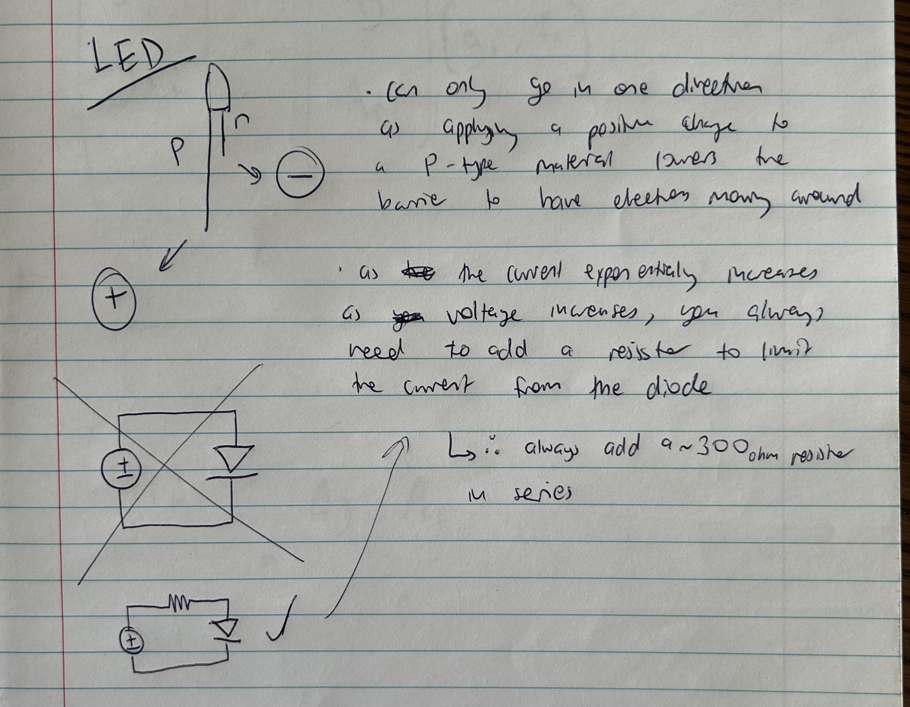
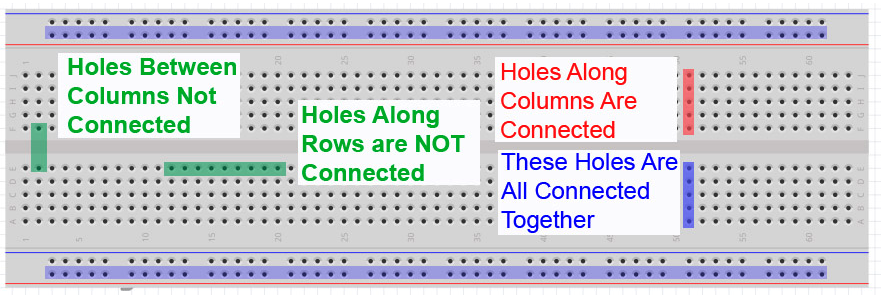

# Working with LEDs

## Summary: Understanding Semiconductors and Their Role in LEDs
Semiconductors are materials whose electrical conductivity falls between that of conductors (like metals) and insulators (like ceramics), with silicon being the most prevalent due to its excellent semiconductor properties and abundance. Their unique feature is the ability to adjust their electrical conductivity through a process called doping, where impurities are added to change the material's electrical characteristics.

### The Essence of Semiconductor Operation
The behavior of semiconductors is fundamentally tied to the flow of valence electrons and holes, which are the primary charge carriers. When external voltage is applied, these carriers move through the semiconductor, facilitating electrical conductivity.

- Valence Electrons: Electrons in the outer shell that are easily removed from an atom.
- Holes: Absences of electrons, acting as positive charge carriers.

### Energy Bands in Solids
When atoms form a solid, their discrete energy levels merge into bands due to interactions among atoms:

- Valence Band: The energy band occupied by electrons at the ground state, responsible for chemical bonding.
- Conduction Band: A higher energy band that electrons can move into, allowing them to move freely and conduct electricity.
- Band Gap: The energy difference between the valence and conduction bands. Its size determines the material's electrical properties (conductors, insulators, or semiconductors).

### Doping and Its Impact
Doping modifies the semiconductor's electrical properties by introducing impurities:

- N-type Doping: Adds donor atoms, increasing free electrons in the conduction band.
- P-type Doping: Introduces acceptor atoms, creating holes in the valence band.

This modification facilitates different types of electrical conduction, enhancing the semiconductor's conductivity.

## LEDs: A Practical Application of Semiconductors
LEDs (Light Emitting Diodes) exemplify the practical use of semiconductors. They are diodes that emit light when electricity is applied, operating on the principle of electron-hole recombination:

1. Applying Voltage: Electrons move from the N-type area (rich in free electrons) to the P-type area (filled with holes).
2. Recombination: Electrons and holes recombine, releasing energy.
3. Photon Emission: The energy release manifests as photons (light), with the material determining the light's color.

## Electronics schema

.png)

## Breadboard reference

